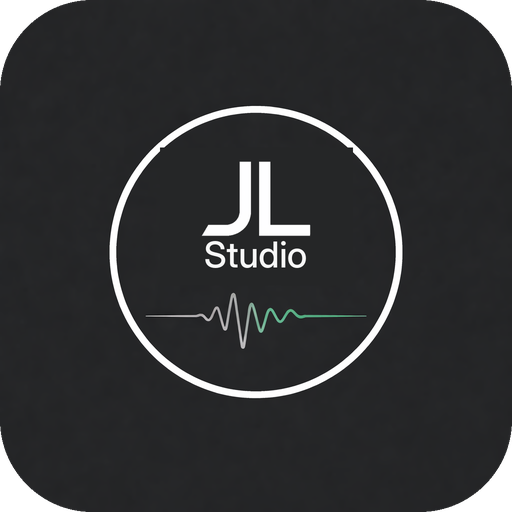

# JLAudio

### Practical tools for modern mixing engineers

**Organize sessions. Automate repetitive work. Build better audio tools.**

JLAudio creates open, practical software for small studios, home studios,
independent mix engineers, and audio developers who want professional
workflows without unnecessary complexity.

 

---

## Built for the Working Engineer

Running a studio involves more than moving faders.

Files need to be organized. Client deliveries need to be checked. Revisions
need to be tracked. Mixes need to be approved, packaged, and recalled months
or years later.

JLAudio develops tools that make those jobs more structured, repeatable, and
dependable—while keeping the engineer in control.

Our projects currently focus on:

- **Studio workflow automation**
- **Professional audio plug-in development**
