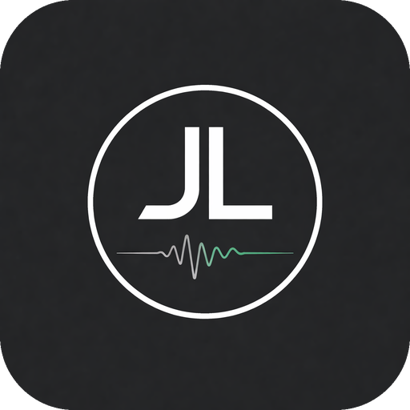

# JL Aspect Works

### Intelligent tools for modern recording and mixing studios

**Studio-aware, open-source software that brings structure, consistency, and intelligence to everyday studio workflows.**

 

<table>
<tr>
<td align="center" width="50%">

### JL Mixing Studio

**Desktop Application**

</td>
<td align="center" width="50%">

### JL Mixing Automation

**CLI Engine**

</td>
</tr>
<tr>
<td align="center" width="50%">

### Engineering

**Architecture & Standards**

</td>
<td align="center" width="50%">

### Brand Assets

**Identity & Design System**

</td>
</tr>
</table>

 

<table>
<tr>
<td align="center"><strong>Current Projects</strong> 2</td>
<td align="center"><strong>Platforms</strong> macOS · Windows · CLI</td>
<td align="center"><strong>License</strong> Apache 2.0</td>
</tr>
</table>

---

## What We Build

Running a studio involves far more than recording audio.

Sessions become projects. Projects become revisions. Revisions become deliveries.

**JL Aspect Works** develops practical software that understands those relationships—helping engineers organize their work, automate repetitive tasks, and focus on making great records.

> **Build tools that understand the way real studios work.**

---

<h2>
  
  JL Mixing Studio
</h2>

Desktop software for managing clients, projects, revisions, metadata, and deliveries through a studio-aware workspace.

**Windows · macOS**

---

<h2>
  
  JL Mixing Automation
</h2>

A command-line workflow engine for structured, repeatable studio operations.

**Cross-platform CLI**

---

## Design Philosophy

**Practical over flashy.**

**Professional without unnecessary complexity.**

**Open by default.**

**Built for real engineers and real studios.**

**Designed to grow with the workflow.**

---

## Open Source

JL Aspect Works is committed to building professional studio software using open technologies whenever practical.

Ideas, bug reports, feature requests, testing, and contributions from the recording and mixing community are welcome.

---

## Brand Assets

The JL Aspect Works identity system, logo masters, product lockups, GitHub graphics, and usage standards will be maintained in the forthcoming `jl-brand` repository.

---

### Engineering better studio workflows.

